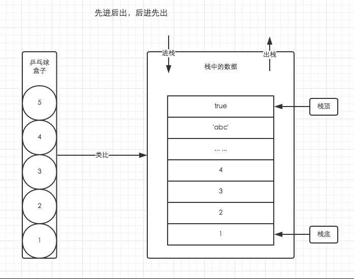
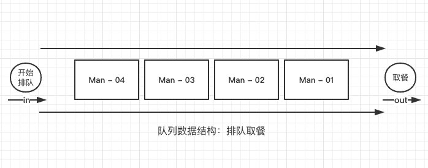

# 集合引用类型

## Obejct

对象创建的实列有两种方式
1. 使用new 操作符和Object构造函数
2. 对象自面量（使用此方法定义对象，并不会实际调用Object函数）
```js
let person = new Object();
person.name = "Nicholas";
person.age = 29;

let person = {
  name: "Nicholas",
  age: 29
};

//获取对象的属性2种方式
console.log(person["name"]); // "Nicholas"//首选使用点语法
console.log(person.name);    // "Nicholas" //访问属性时候需要使用变量用这种方式
```
## Array

创建数组的方式
数组里面可以是数值，字符串，对象
1. 使用new 操作符和Array构造函数
2. 数组自面量（使用此方法定义数组，并不会实际调用Array函数）

```js
let array = new Array();//里面可以添加参数，如果只有一个数值类型的参数是定义数组的长度
let array = Array();//可以省略new
let array1 = [];
```
es6新增两个数组方法

```js
//from()和of()
//from 用于将类数组转换为数组实例，
//of 用于将一组参数转换为数组实例

//new Map() 映射 以键值对的方式
//new Set()去除重复数组
// 可以使用from()将集合和映射转换为一个新数组
const m = new Map().set(1, 2)
                   .set(3, 4);
const s = new Set().add(1)
                   .add(2)
                   .add(3)
                   .add(4);

console.log(Array.from(m)); // [[1, 2], [3, 4]]
console.log(Array.from(s)); // [1, 2, 3, 4]
//浅拷贝
/*
1.只复制指向某个对象的指针，而不复制对象本身，新旧对象还是共享同一块内存。
2.像数组里面方法进行浅拷贝，数组里如果有引用类型，修改引用类型新值旧值才会一起改变，如果没修改引用类型是不变的
（换句话说就是数组里面的方法进行浅拷贝第一层，后面第二层开始如果修改是引用类型的话就会跟着变）
*/

// Array.from()对现有数组执行浅拷贝
const a1 = [1, 2, 3, 4];
const a2 = Array.from(a1);
console.log(a1);        // [1, 2, 3, 4]

// arguments对象可以被轻松地转换为数组
function getArgsArray() {
  return Array.from(arguments);
}
console.log(getArgsArray(1, 2, 3, 4)); // [1, 2, 3, 4]

//还可以转自定义对象
// from()也能转换带有必要属性的自定义对象
const arrayLikeObject = {
  0: 1,
  1: 2,
  2: 3,
  3: 4,
  length: 4
};
console.log(Array.from(arrayLikeObject)); // [1, 2, 3, 4]

//from()的第二个参数可以对数组进行修改，第三个可以映射this，箭头函数不适应
const a1 = [1, 2, 3, 4];
const a2 = Array.from(a1, x => x**2);
const a3 = Array.from(a1, function(x) {return x**this.exponent}, {exponent: 2});
console.log(a2);  // [1, 4, 9, 16]
console.log(a3);  // [1, 4, 9, 16]

//of()可以进行将参数转换成数组
console.log(Array.of(1, 2, 3, 4)); // [1, 2, 3, 4]
```

### 如何检测是不是数组

```js

//第一种  instanceof
if (value instanceof Array){
  // 操作数组
}

//第二种 es6 提供的  isArray函数

if (Array.isArray(value)){
  // 操作数组
}

```
### 数组的迭代器

```js
//三种方法  keys() 索引 values()值 entries()索引+值 

const a = ["foo", "bar", "baz", "qux"];

// 因为这些方法都返回迭代器，所以可以将它们的内容
// 通过Array.from()直接转换为数组实例
const aKeys = Array.from(a.keys());
const aValues = Array.from(a.values());
const aEntries = Array.from(a.entries());

console.log(aKeys);     // [0, 1, 2, 3]
console.log(aValues);   // ["foo", "bar", "baz", "qux"]
console.log(aEntries);  // [[0, "foo"], [1, "bar"], [2, "baz"], [3, "qux"]]


//es6 轻松的解构出键值对
const a = ["foo", "bar", "baz", "qux"];

for (const [idx, element] of a.entries()) {
  alert(idx);
  alert(element);
}
// 0
// foo
// 1
// bar
// 2
// baz
// 3
// qux
```

### 数组的复制和填充方法


```js
//es6新增方法  copyWithin() fill()  使用不会改变数组大小

//fill()
//第一个参数是往数组填充什么值，第二个参数是大于多少，第三个参数是在二参数和三参数之前的进行替换，填负数也会变成正数
//fill()静默忽略超出数组边界、零长度及方向相反的索引范围,部分索引就填充部分
const zeroes = [0, 0, 0, 0, 0];

// 用5填充整个数组
zeroes.fill(5);
console.log(zeroes);  // [5, 5, 5, 5, 5]
zeroes.fill(0);       // 重置

// 用6填充索引大于等于3的元素
zeroes.fill(6, 3);
console.log(zeroes);  // [0, 0, 0, 6, 6]
zeroes.fill(0);       // 重置

// 用7填充索引大于等于1且小于3的元素
zeroes.fill(7, 1, 3);
console.log(zeroes);  // [0, 7, 7, 0, 0];
zeroes.fill(0);       // 重置

// 用8填充索引大于等于1且小于4的元素
// (-4 + zeroes.length = 1)
// (-1 + zeroes.length = 4)
zeroes.fill(8, -4, -1);
console.log(zeroes);  // [0, 8, 8, 8, 0];

//copyWithin() 一个参数时候，从0到这个参数进行复制然后在这个参数后进行插入，直到插入到数组边界
//两个参数的话就是  第一位插入的位置，第二位是从这个参数开始进行复制
//三个参数的话，第一个插入位置第二个从第几个开始第三个是到那个位置结束


```

### 数组转换方法(对象都有这几个方法)
 所有对象都有这些方法
```js
toLocaleString()
toString()//由逗号分隔的字符串
valueOf()  //返回数组本身
//toLocaleString()和toString() 有区别的，当转换数字时候toLocaleString会3个数字前会加逗号， 转换时间也是不同的

//toLocaleString()  toString()转换成字符串 都是以逗号分隔 如果不想用逗号分隔 可以使用 join函数进行替换
//join()是数组函数，
let arr = [1,2,3,4]
console.log(arr.join('|'))  //"1|2|3|4"

```
### 数组栈方法
```js
// push() pop()
//像栈一样， 限制插入和删除的数据结构，只能有同一个出入口   后进先出 （Last-in-first-out）的结构 
//数据插入 (称为push) 数据删除（称为pop） ，无论是删除还是插入都在同一个地方发生，即栈顶
//类似乒乓球盒子 最下面的是1 最顶上的是5  每次都在顶部插入和删除

//push 可以接受任意数量的参数，并将它们添加到数组末尾
let colors = new Array();                 // 创建一个数组
let count = colors.push("red", "green");  // 推入两项
alert(count);                             // 2

count = colors.push("black");  // 再推入一项
alert(count);                  // 3
//pop 用于删除数组的最后一项，同时减少数组的length值，返回呗删除的项

let item = colors.pop();       // 取得最后一项  3
alert(item);                   // black
alert(colors.length);  //2

```



### 数组列队方法

```js
//限制访问的数据结构，队列以先进先出(FIFO, First-In-First-Out)形式限制访问
//队列是在列表末尾添加数据 但从开头进行获取数据。
//末尾添加  push()
//开头获取  shift() ，它删除数组的第一项并返回它，在数组长度减1，  使用shift和push可以把数组当队列使用

let colors = new Array();                 // 创建一个数组
let count = colors.push("red", "green");  // 推入两项
alert(count);                             // 2

count = colors.push("black"); // 再推入一项
alert(count);                 // 3

let item = colors.shift();  // 取得第一项
alert(item);                // red
alert(colors.length);       // 2
/*

反向队列 可以使用  unshift 和pop 一起使用。
unshift是从头部开始添加多个任意值，返回新的数组长度，
*/


let arr = ['a','b'];
arr.unshift('c','d');
console.log(arr) //c,d,a,b
```



<a href="https://www.cnblogs.com/slly/p/10366290.html" >js中的栈、堆、队列、内存空间</a>

### 数组排序方法

```js
//reverse()反转和sort()排序

let arr = [1,2,3,4,5];
consolse.log(arr.severse())//5,4,3,2,1


let arr2 = [1,11,5,4,13,23];

console.log(arr2.sort())//1,11,13,23,4,5
// 注意 sort 排序是从第一位数字开始对比排序

```
### 操作方法

```js
//concat slice  splice 
//concat 连接
/*
将现有数组全部元素得基础上创建一个新的数组，先创建当前数组的副本，在把他的参数添加嗷副本末尾，最后返回新构建的数组
如果传入多个数组，则会把这些数组的而每一项都添加到结果数组中，如果不是数组，则直接把他们添加到结构数组末尾。

如果不想打平数组可以 通过Symbol改变
*/

let colors = ["red", "green", "blue"];
let newColors = ["black", "brown"];
let moreNewColors = {
  [Symbol.isConcatSpreadable]: true,
  length: 2,
  0: "pink",
  1: "cyan"
};

newColors[Symbol.isConcatSpreadable] = false;//不大平数组的参数 利用Symbol.isConcatSpreadable

// 强制不打平数组
let colors2 = colors.concat("yellow", newColors);

// 强制打平类数组对象
let colors3 = colors.concat(moreNewColors);

console.log(colors);   // ["red", "green", "blue"]
console.log(colors2);  // ["red", "green", "blue", "yellow", ["black", "brown"]]
console.log(colors3);  // ["red", "green", "blue", "pink", "cyan"]


/*
slice() 创建一个包含原有数组中一个或多个元素的新数组。
可以接受一个或者两个参数， 返回元素的开始索引和结束索引
1个参数，返回从开始索引到结束索引的所有元素，不包含当前索引的元素，不会影响原始 数组。
2个参数 silce 反不会从开始到结束索引的所有元素，不包含结束所有对应的元素。
不会对原始数组有影响

*/

let colors = ["red", "green", "blue", "yellow", "purple"];
let colors2 = colors.slice(1);
let colors3 = colors.slice(1, 4);

alert(colors2);  // green,blue,yellow,purple
alert(colors3);  // green,blue,yellow

/*
slice  可以使用负值， 如果有负值 那么就以长度加上这个负值的结果确定位置，
如果5个元素的数组 ，alice(-2,-1) = sliec(3,4)
如果结束位置小于开始位置，则返回空数组
*/
```
```js
//splice()//很强大的方法

//删除  splice()，需要传2个参数，删除的第一个元素位置和要删除的元素的数量。
//插入 splice()， 传3个参数，开始位置，0（要删除的元素数量），和要插入的元素
//替换 splice()，传三个参数，开始位置，要替换的元素数量，要插入的任意多个元素

```
### 搜索和位置方法 
```js
//三个搜索方法
//indexof() lastIndexOf()  // includes() es7方法   
/*
都是接受2个参数，要查找的元素，和一个可选起始搜索位置
lastIndexof 是从数组末尾向前开始搜索
*/
//indexof，lastIndexOf 找不到就返回 -1， includes 返回 布尔值 
//includes 查找有没有 比较使用的 === 严格 数值和类型一起比较

let a = ['123',12,{name:1}];
console.log(a.includes('12')) //false
console.log(a.includes(12))//true
```
### 断言函数


```js
//三个参数  元素，索引，数组本身
//find() findIndex() 使用了断言函数  //找到匹配后不会在继续搜索

let arr = [
    {
        name:'zhangsan',
        age:29
    },
    {
        name:'wangwu',
        age:30
    }
]
console.log(arr.find((ele,index,arr)=>ele.age<30));//{ name:'zhangsan',age:29}

console.log(arr.findIndex((ele , index , arr)=>ele.age == 30));//1

```


### 数组的迭代方法 

```js
/*


filter() 对数组每一项都院校传入的函数，函数返回true的项会组成数组之后返回

forEach() 对数组每一项都运行都传入的函数，没有返回值

map() 对每个数组都运行传入的函数，返回由每次函数调用的结果组成的函数

every() 对数组每一项都运行传入的函数，如果对每一项函数都返回true ，则这个方法返回true

some() 对数组每一项都运行传入的函数，如果有一项函数返回 true ，则这个方法返会true

4个方法都不会改变原数组 

*/
let arr  = [ 1,2,3,4,5,6,7,8 ];
console.log(arr.some((item,index,array)=> item>2)) //true  有就true
console.log(arr.every((item,index,array)=> item>2)) //false 全部有 才true


/*
map()
*/
let arr0  = [ 1,2,3,4,5,6,7,8];
let arr1 = arr0.map((item,index,array)=> item*2)
console.log(arr1)//[2, 4, 6, 8, 10, 12, 14, 16]  对数组循环 每一项可以进行操作并返回你操作后的每一项组成数组返回给你


/*
filter()  
*/

let arr = [
    {
        name:'zhangsan',
        age:29
    },
    {
        name:'wangwu',
        age:30
    }
]
console.log(arr.filter((ele,index,arr)=>ele.age<30));// [{ name:'zhangsan',age:29}]

/*
forEach() 本质上等于  使用for循环遍历数组
*/
let numbers = [1, 2, 3, 4, 5, 4, 3, 2, 1];

let arrnumber = numbers.forEach((item, index, array) => {
  // 执行某些操作

});

```
### 归并方法

```JS
//   归并方法是指 迭代数组所有项并在此基础之上构建最终的返回值
//reduce()从前到后
//reduceRight() 从后到前
//4个参数  上一个归并值，当前项，当前项得索引，数组本身

let arr = [1,2,3,4,5,6,7,8,9,10]
//console.log(arr.reduce((prev,cur,index,arr)=> prev+cur))// 所有数字求和

```


## 定型数组

1. 为了满足WebGL 与js运行传递数组的性能问题
2. CavnasFloatArray -> Float32Array

ArrayBuffer()是一个普通js构造函数，用于分配特定数量的自己空间

```js
const buf = new ArrayBuffer(16);
alert(buf.byteLength)//16
const buf2 = buf.slice(4, 12); //一旦生成不能改变其大小，可以slice复制其全部或者部分到一个新实例中
alert(buf2.byteLength);  // 8

//Arraybuffer 分配失败会抛出异常，大小有最大显示 2的53次方减1
//ArrayBuffer 分配的对内存可以被当作垃圾回收，不需要手动释放
/*
不能仅通过对ArrayBuffer的引用就读取或写入其内容。
要读取或写入ArrayBuffer，就必须通过视图。
视图有不同的类型，但引用的都是ArrayBuffer中存储的二进制数据。
*/
```
DataView() 第一种 读写ArrayBuffer的视图  转为文件I/O和网络I/O设计

6.3.1 - 6.4 略过  目前读起来帮助不大


## Map

es6新出的键值对的集合类型，es6之前都是使用 对象属性作为键，在使用属性离引用值

```js
//使用  new 和Map 构造函数 可以创建一个空映射

const m = new Map();

//可以直接 嵌套数组初始化映射

const m1 = new Map([
  ["key1":"val1"],
  ["key2":"val2"]
]);
console.log(m1.size) //2
//也可以自定义迭代器初始化映射
const m2 = mew Map({
  [symbol.iterator]:function*(){
    yieid  ["key1":"val1"];
    yieid  ["key2":"val2"];
    yieid  ["key3":"val3"];
  }
});
alert(m2.size);//3

//get has 进行查询 clear delete进行清除  set返回映射实例还可以多个操作连起来。
const m = new Map();

alert(m.has("firstName"));  // false
alert(m.get("firstName"));  // undefined
alert(m.size);              // 0

m.set("firstName", "Matt")
 .set("lastName", "Frisbie");

alert(m.has("firstName")); // true
alert(m.get("firstName")); // Matt
alert(m.size);             // 2

m.delete("firstName");     // 只删除这一个键/值对

alert(m.has("firstName")); // false
alert(m.has("lastName"));  // true
alert(m.size);             // 1

m.clear(); // 清除这个映射实例中的所有键/值对

alert(m.has("firstName")); // false
alert(m.has("lastName"));  // false
alert(m.size);             // 0
//

const ma = new Map();
ma.set("firstName", "Matt")
 .set("lastName", "Frisbie");

//object 只能使用数值，字符串或符号作为健不同， Map可以使用任何js数据类型作为键，
```

Map 迭代器

```js
//Iterator()
//entries()
const M = new Map(["key1","val1"],["key2","val2"],["key3","val3"]);

alert(m.entries === m[Symbol.iterator]);//true

for(let pair of m.entries()) {
  alert(pair);
}
//[key1,val1]
//[key2,val2]
//[key3,val3]
for (let pair of m[Symbol.iterator]()) {
  alert(pair);
}
// [key1,val1]
// [key2,val2]
// [key3,val3]

// entries() 是默认迭代器 使用 展开运算符就可以直接转换成数组
console.log([...m])
```
#### 选择Object 还是Map
```js
1. 内存占用
/*Obj和Map的工程级实现在不同的浏览器间存在明显差异，
  不同浏览器的情况不同，但给定固定大小的内存，Map大约可以比Obj多存储50% 的健/值对。
*/
2. 插入性能
/*Object 和Map 中插入新建/值对的消耗大致相当，不过插入Map在所有浏览器中一般会稍微快一点儿。
对这个两个类型来说，插入速度并不会随着 键/值对数量而线性增加，如果代码涉及大量插入操作，那么显然
Map的性能更佳。
*/ 
3. 查找速度
/*
如果大量查找  Obj会更好
*/
4. 删除性能
/*
Map 的delte() 速度快
*/
```


## WeakMap（es6 新增 弱映射）
<br>
weakMap API是Map的子集
<br>
weakMap 键只能是obj或者继承自obj的类型，非对象就好报出typeError， 值类型没有限制
<br>
初始化之后可以使用set()再添加键/值对，可以使用get()和has()查询，还可以使用delete()删除
<br>
初始化是全有全无的操作，中间有一个无效键就会导致整个初始化失败。
<br>
原始值可以包装成对象在用作键
<br>

```js
const key1 = {id: 1},
      key2 = {id: 2},
      key3 = {id: 3};
// 使用嵌套数组初始化弱映射
const wm1 = new WeakMap([
  [key1, "val1"],
  [key2, "val2"],
  [key3, "val3"]
]);
alert(wm.get(key1)); // val1
alert(wm.get(key2)); // val2
alert(wm.get(key3)); // val3

// 初始化是全有或全无的操作
// 只要有一个键无效就会抛出错误，导致整个初始化失败
const wm2 = new WeakMap([
  [key1, "val1"],
  ["BADKEY", "val2"],
  [key3, "val3"]
]);
// TypeError: Invalid value used as WeakMap key
typeof wm2;
// ReferenceError: wm2 is not defined

// 原始值可以先包装成对象再用作键
const stringKey = new String("key1");
const wm3 = new WeakMap([
  stringKey, "val1"
]);
alert(wm3.get(stringKey)); // "val1"

```
weakMap 中的weak 表示弱弱的拿着，不属于正式的引用，不会阻止垃圾回收，
但是若映射的值不是 弱弱的拿着，只要键存在，就会存在映射中，并被当作对值得引用。

```js
const wm = new WeakMap();

wm.set({},"val");//因为映射键为空， 这个对象键就被当作垃圾回收，键值对得若映射就消失了，称为一个空映射

console.log(wm);
```

```js
const contriner = {
  key:{

  }
}
const wm = new WeakMap();

wm.set(contriner.key,"val")//弱键在被  contriner对象维护得引用

function delcontriner () { //执行这个函数就会 触发垃圾回收程序 把这个键/值干掉
  constriner.key = null;
}

```


