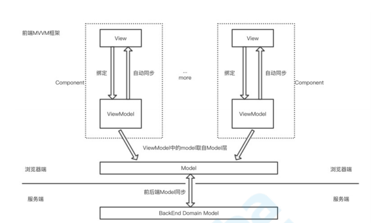
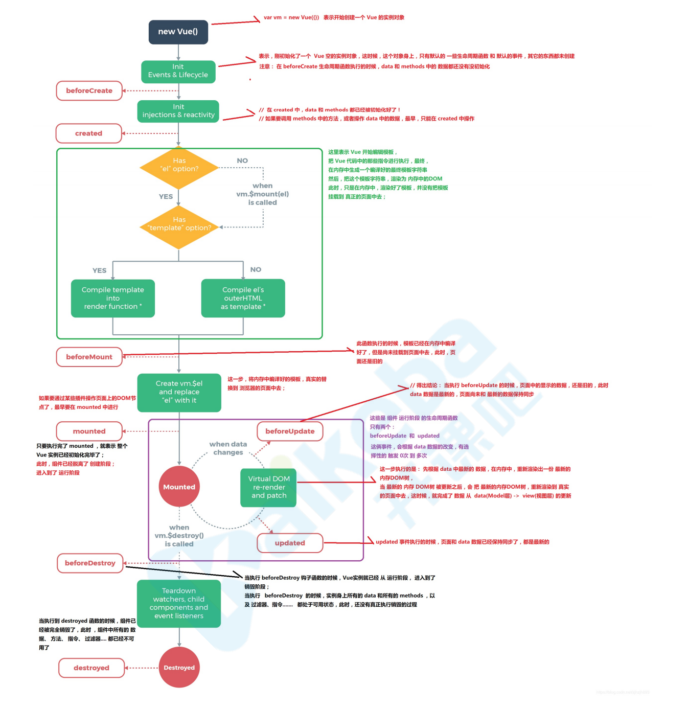
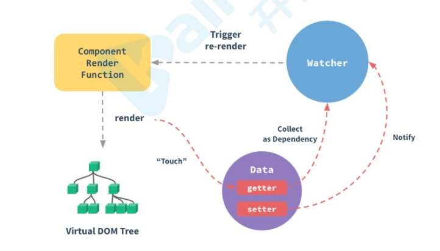

# Vue面试题

## 1.你对MVVM如何理解？

MVVM模式是什么？

MVVM模式，顾名思义即Model-View-ViewModel模式。它萌芽于05年微软退出的基于windows的用户框架WPF，前端最早的MVVM框架 knockout在 10年发布。

Model层：对应数据层的域模型，它主要做域模型的同步。通过Ajax/fetch等API完成客户端和服务端业务Model的同步，在层级关系里，它主要用于抽象出ViewModel中的视图的Model。

View层：作为视图模板存在，在MVVM里，整个View是一个动态模板。除了定义结构、布局外，它展示的是ViewModel层的数据和状态。View层不负责处理状态，View层做的是 数据绑定的声明、指令的声明、事件绑定的声明。

ViewModel层：把View需要的层数据暴露，并对View层的数据绑定声明、指令声明、时间绑定声明、负责、也就是处理View层的具体业务逻辑。ViewModel底层会做好绑定属性的监听。当ViewModel中数据变化，View层会得到更新；而当View中声明了数据的双向绑定(通常是表单元素)，框架也会监听View层（表单）值的变化。一旦值变化，View层绑定的ViewModel中的数据也会得到自动更新。



MVVM的优缺点：
* 	优点:

	1.分离视图（View）和模型（Model），降低代码耦合，提高视图或者逻辑的重用性：比如视图（View）可以独立于Model变化和修改，一个ViewModel可以绑定不同的'View'上，当View变化的时候Model不可以不变，当Model变化的时候View也可以不变。你可以把一些视图逻辑放在一个ViewModel里面，让很多view重用这段视图逻辑

	2.提高测试性：ViewModel的存在可以帮助开发者更好地编写测试代码

	3.自动更新dom；利用双向绑定，数据更新后视图自动更新，让开发者从满所的手动dom中解放。

* 	缺点：

	1.Bug很难被调试，因为使用双向绑定的模式，当你看到界面异常了，有可能是你View的代码有Bug，也可能是Model的代码有问题，数据绑定使一个位置的Bug被快速传递到别的位置，要定位原始出问题的地方变得不那么容易了。另外，数据绑定的声明是指令式地写在View的模板当中的，这些内容是没有办法打断点debug的。

	2.一个大的模块中的model也会很大，虽然使用方便了也很容易保证了数据的一致性，当时长期持有，不释放内存就会造成了花费更多的内存。

	3.对于大型的视图应用程序，视图状态较多，ViewModel的构建和维护的成本都会比较高。


## 2.你对Vue生命周期的理解？

生命周期是什么
	
* Vue实例有一个完整的生命周期，也就是从开始创建、初始化数据、编译模板、挂载Dom->渲染、更新->渲染、卸载等一系列过程，我们称这是Vue的生命周期。

	各个生命周期的作用

	|生命周期 |  描述  |
	|  ----  | ----  |
	| beforeCreate  | 组件实例 被创建之初，组件的属性生效之前 |
	| created  | 组件实例已经完全创建，属性也绑定，但真实dom还没生成，$el还不可用 |
	| beforeMount | 在挂载开始之前被调用：相关的render函数首次被调用 |
	| mounted  | el被新创建的vm.$el替换，并挂载到实例上去之后调用该钩子 |
	| beforeUpdate  | 组件数据更新之前调用，发生在虚拟DOM打补丁之前 |
	| update  | 组件数据更新之后 |
	| activited  | keep-alive专属，组件被激活时调用 |
	| deadctivated  | keep-alive专属，组件被销毁时调用 |
	| beforeDestory  | 组件销毁前调用 |
	| destoryed  | 组件销毁后调用 |

	生命周期示意图

	

### 异步请求合适在哪个生命周期调用？

官方实例的异步请求是在 mounted生命周期中调用的，而实际上也可以在created生命周期中调用。

## 3.Vue如何通信？

1. props/$emit+v-on: 通过props将数据自上而下传递，而通过$emit和v-on来向上传递信息。
2. EventBus:通过EventBus进行信息的发布与订阅
3. vuex：是全局数据管理库，可以通过vuex管理全局的数据流
4. $attr/$listeners:Vue2.4中加入的$attr/$listeners可以进行跨级的组件通信
5. provide/inject: 以 允许一个祖先组件向其所有子孙后代注入一个依赖，不论组件层次有多深，并在起上下游关系成立的时间里始终生效，这成为了跨组件通信的基础

## 4.computed和watch有什么区别？

computed:

1. computed 是计算属性，也就是计算值，它更多用于计算值的场景
2. computed 具有缓存性，computed的值在getter执行后是会缓存的，只有在它依赖的属性值改变之后，下一次获取computed的值才会重新调用对应的getter来计算
3. computed 试用于计算比较消耗性能的计算场景

wach:

1. 更多的是 [观察] 的作用，类似于某些数据的监听毁掉，用于观察 props  $emit 或者本组件的值，当数据变化时来执行回调进行后续操作
2. 无缓存性，页面重新渲染时值不变化也会执行

小结：

1. 当我们要进行数据计算，而且依赖于其他数据，那么把这个数据设计为computed

2. 如果你需要在某个数据变化时做一些事情，使用watch来观察这个数据变化

## 5.Vue是如何实现双向绑定的?

利用 Obejct.defineProperty 劫持对象的访问器，在属性值发生变化时我们可以获取变化，然后根据变化进行后续响应，在Vue3.0中通过Proxy代理对象进行类似的操作。

``` bash
//这是将要被劫持的对象

const data = {
	name:'',
};

function say(name){
	if(name === '古天乐') {
		console.log('给大家推荐一款超好玩的游戏');
	} else if (name === '渣渣辉') {
		console.log('戏我演过很多，可游戏我只玩贪玩蓝月');
	} else {
		console.log('来做我的兄弟')
	}
}
//遍历对象，对其属性值进行劫持
Object.keys(data).forEach(function(key)) {
	Object.defineProperty(data,key,{
		enumerable:true,
		configuerable:true,
		get:function() {
			console.log('get');
		},
		set:function(newVal) {
			console.log('大家好，我系${newVal}');
			say(newVal);
		},
	})
});

data.name = '渣渣辉';
//大家好，我系渣渣辉
//戏我演过很多，可游戏我只玩贪玩蓝月

```

###  Proxy与Object.defineProperty的优劣势(追问)

Proxy的优势如下：</br>
	Proxy可以直接监听对象而非属性</br>
	Proxy可以直接监听数组的变化</br>
	proxy有多达13种拦截方法，不限于apply、ownKeys、deleteProperty、has等等是 Object.defineProperty 不具备的</br>
	Proxy作为新标准将受到浏览器厂商重点持续的性能优化，也就是传说中的新标准的性能红利</br>

Obejct.defineProperty的优势如下：
	兼容性好，支持IE9

## 6.你是如何理解Vue的响应式系统的?


响应式系统简述:</br>
	任何一个 Vue Component 都有一个与之对应的Watcher实例。</br>
	Vue的data上的属性会被添加getter和setter属性。</br>
	当Vue Component render函数被执行的时候，data上会被触碰(touch)，即被读，getter方法会被调用，此时Vue会去记录此Vue Component所以来的所有data。（这一过程被称为依赖收集）</br>
	data被改动时(主要是用户操作)，即被写，setter方法会被调用，此时Vue会去通知所有依赖于此data的组件去调用他们的render函数进行更新。</br>
### 既然Vue通过数据劫持可以精准探测数据变化，为什么还需要虚拟DOM进行diff检测差异?
考点: Vue的变化侦测原理</br>

前置知识：依赖收集、虚拟DOM、响应式系统</br>

现代前段框架有两种方式侦测变化，一种是pull一种是push</br>

pull：其代表为Rect，我们可以回忆一下React是如何侦测到变化的，我们通常会用 setState API 显示更新，然后React会进行一层层的Virtual Dom Diff操作找出差异，然Patch到Dom上，React从一开始就不知道到底是哪发生了变化，只是知道[有变化了]，然后进行比较暴力的Diff操作查找 [哪发生变化了]，另外一个代表就是Angular 的脏检查操作。</br>

push:Vue的响应式系统则是push的代表，当Vue程序初始化的时候就会对数据data进行依赖的收集，一旦数据发生变化，响应式系统就会立刻得知，因此Vue是一开始就知道是[在哪发生变化了]，但是这又会产生一个问题，如果你熟悉Vue的响应式系统就知道，通常一个绑定一个数据就需要一个Watcher，一旦我们的绑定细粒度过高就会产生大量的Watcher，这回带来内存以及依赖追逐的开销，而细粒度过地回无法精准侦测变化，因此Vue的设计师选择中的呢个细粒度的方案。在组件级别进行push侦测的方式，也就是那套响应式系统，通常我们会第一时间侦测到发生变化的组件，然后在组件内部进行Virtual Dom Diff获取更加具体的差异，而Virtual Dom Diff 则是pull操作，Vue是push+pull结合的方式进行变化侦测的。

## 7.Vue为什么没有类似于React中shouldComponentUpdate的生命周期？

考点：Vue的变化侦测原理</br>

前置知识：依赖收集、虚拟DOM、响应式系统</br>

React是pull的方式侦测变化，当React知道发生变化后，会使用Virtual Dom进行差异检测，但是很多组件实际上是肯定不会发生变化的，这个时候需要用shouldComponentUpdate进行手动操作来减少diff，从而提高程序整体的性能</br>

Vue是pull+push的方式侦测变化的，在一开始就知道那个组件发生了变化，因此在push的阶段并不需要手动控制diff，而组件内部采用的diff方式实际上是可以引入类似于shouldComponentUpdate相关生命周期的，但是通常合理大小的组件不会有过量的diff，手动优化的价值有限，一次目前Vue并没有考虑引入shouldComponentUpdate这种手动优化的生命周期。</br>

## 8.Vue中的key到底有什么作用？

key是为Vue中的vnode标记的唯一id，通过这个key，我们的diff操作可以更准确，更快速</br>

diff算法的过程中，先进行新旧节点的首尾交叉对比，当无法匹配的时候会用新节点key与旧节点进行比对，然后找出差异。</br>

```
diff程可以概括为：oldCh和newCh个有两个头尾的变量Startldx和Enddx，他们的2个变量互相比较，一共有4种比较方式。如果4种比较陡没匹配，如果设置了key，就会用key进行比较，在比较过程中，变量会让中间靠，一旦startidx > Endldx表明oldCh和newCh至少有一个以及遍历完了，就会结束比较，这四种比较方式就是首、尾、旧尾新头，旧头新尾。

```
</br>
准确：如果不加key，那么vue会选择复用节点（Vue的就地更新策略），导致之前节点的状态被保留下来，会产生一系列的bug。</br>

快速：key的唯一性可以被Map树结构充分利用，相比于遍历查找的时间复杂度O(n),Map的时间复杂度仅仅为O(1)</br>


```bash

function createKeyToOldIdx(chilren,beginIdx,endIdx) {
	let i,key
	const map = {}
	for (i = beginIdx; i <= endIdx; ++i){
		key = children[i].key
		if(isDef(key)) map[key] = i
	}
	rerturn map
}


```


