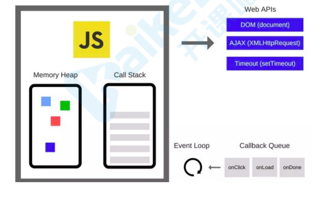

# Vue面试题

## 1.你对MVVM如何理解？

MVVM模式是什么？

MVVM模式，顾名思义即Model-View-ViewModel模式。它萌芽于05年微软退出的基于windows的用户框架WPF，前端最早的MVVM框架 knockout在 10年发布。

Model层：对应数据层的域模型，它主要做域模型的同步。通过Ajax/fetch等API完成客户端和服务端业务Model的同步，在层级关系里，它主要用于抽象出ViewModel中的视图的Model。

View层：作为视图模板存在，在MVVM里，整个View是一个动态模板。除了定义结构、布局外，它展示的是ViewModel层的数据和状态。View层不负责处理状态，View层做的是 数据绑定的声明、指令的声明、事件绑定的声明。

ViewModel层：把View需要的层数据暴露，并对View层的数据绑定声明、指令声明、时间绑定声明、负责、也就是处理View层的具体业务逻辑。ViewModel底层会做好绑定属性的监听。当ViewModel中数据变化，View层会得到更新；而当View中声明了数据的双向绑定(通常是表单元素)，框架也会监听View层（表单）值的变化。一旦值变化，View层绑定的ViewModel中的数据也会得到自动更新。


MVVM的优缺点：
* 	优点:

	1.分离视图（View）和模型（Model），降低代码耦合，提高视图或者逻辑的重用性：比如视图（View）可以独立于Model变化和修改，一个ViewModel可以绑定不同的'View'上，当View变化的时候Model不可以不变，当Model变化的时候View也可以不变。你可以把一些视图逻辑放在一个ViewModel里面，让很多view重用这段视图逻辑

	2.提高测试性：ViewModel的存在可以帮助开发者更好地编写测试代码

	3.自动更新dom；利用双向绑定，数据更新后视图自动更新，让开发者从满所的手动dom中解放。

* 	缺点：

	1.Bug很难被调试，因为使用双向绑定的模式，当你看到界面异常了，有可能是你View的代码有Bug，也可能是Model的代码有问题，数据绑定使一个位置的Bug被快速传递到别的位置，要定位原始出问题的地方变得不那么容易了。另外，数据绑定的声明是指令式地写在View的模板当中的，这些内容是没有办法打断点debug的。

	2.一个大的模块中的model也会很大，虽然使用方便了也很容易保证了数据的一致性，当时长期持有，不释放内存就会造成了花费更多的内存。

	3.对于大型的视图应用程序，视图状态较多，ViewModel的构建和维护的成本都会比较高。


## 2.你对Vue生命周期的理解？

生命周期是什么
	
* Vue实例有一个完整的生命周期，也就是从开始创建、初始化数据、编译模板、挂载Dom->渲染、更新->渲染、卸载等一系列过程，我们称这是Vue的生命周期。

	各个生命周期的作用

	|生命周期 |  描述  |
	|  ----  | ----  |
	| beforeCreate  | 组件实例 被创建之初，组件的属性生效之前 |
	| created  | 组件实例已经完全创建，属性也绑定，但真实dom还没生成，$el还不可用 |
	| beforeMount | 在挂载开始之前被调用：相关的render函数首次被调用 |
	| mounted  | el被新创建的vm.$el替换，并挂载到实例上去之后调用该钩子 |
	| beforeUpdate  | 组件数据更新之前调用，发生在虚拟DOM打补丁之前 |
	| update  | 组件数据更新之后 |
	| activited  | keep-alive专属，组件被激活时调用 |
	| deadctivated  | keep-alive专属，组件被销毁时调用 |
	| beforeDestory  | 组件销毁前调用 |
	| destoryed  | 组件销毁后调用 |

	生命周期示意图

	

### 异步请求合适在哪个生命周期调用？

官方实例的异步请求是在 mounted生命周期中调用的，而实际上也可以在created生命周期中调用。

## 3.Vue如何通信？

1. props/$emit+v-on: 通过props将数据自上而下传递，而通过$emit和v-on来向上传递信息。
2. EventBus:通过EventBus进行信息的发布与订阅
3. vuex：是全局数据管理库，可以通过vuex管理全局的数据流
4. $attr/$listeners:Vue2.4中加入的$attr/$listeners可以进行跨级的组件通信
5. provide/inject: 以 允许一个祖先组件向其所有子孙后代注入一个依赖，不论组件层次有多深，并在起上下游关系成立的时间里始终生效，这成为了跨组件通信的基础

## 4.computed和watch有什么区别？

computed:

1. computed 是计算属性，也就是计算值，它更多用于计算值的场景
2. computed 具有缓存性，computed的值在getter执行后是会缓存的，只有在它依赖的属性值改变之后，下一次获取computed的值才会重新调用对应的getter来计算
3. computed 试用于计算比较消耗性能的计算场景

wach:

1. 更多的是 [观察] 的作用，类似于某些数据的监听毁掉，用于观察 props  $emit 或者本组件的值，当数据变化时来执行回调进行后续操作
2. 无缓存性，页面重新渲染时值不变化也会执行

小结：

1. 当我们要进行数据计算，而且依赖于其他数据，那么把这个数据设计为computed

2. 如果你需要在某个数据变化时做一些事情，使用watch来观察这个数据变化

## 5.Vue是如何实现双向绑定的?

利用 Obejct.defineProperty 劫持对象的访问器，在属性值发生变化时我们可以获取变化，然后根据变化进行后续响应，在Vue3.0中通过Proxy代理对象进行类似的操作。

``` javascript
//这是将要被劫持的对象

const data = {
	name:'',
};

function say(name){
	if(name === '古天乐') {
		console.log('给大家推荐一款超好玩的游戏');
	} else if (name === '渣渣辉') {
		console.log('戏我演过很多，可游戏我只玩贪玩蓝月');
	} else {
		console.log('来做我的兄弟')
	}
}
//遍历对象，对其属性值进行劫持
Object.keys(data).forEach(function(key)) {
	Object.defineProperty(data,key,{
		enumerable:true,
		configuerable:true,
		get:function() {
			console.log('get');
		},
		set:function(newVal) {
			console.log('大家好，我系${newVal}');
			say(newVal);
		},
	})
});

data.name = '渣渣辉';
//大家好，我系渣渣辉
//戏我演过很多，可游戏我只玩贪玩蓝月

```

###  Proxy与Object.defineProperty的优劣势(追问)

Proxy的优势如下：</br>
	Proxy可以直接监听对象而非属性</br>
	Proxy可以直接监听数组的变化</br>
	proxy有多达13种拦截方法，不限于apply、ownKeys、deleteProperty、has等等是 Object.defineProperty 不具备的</br>
	Proxy作为新标准将受到浏览器厂商重点持续的性能优化，也就是传说中的新标准的性能红利</br>

Obejct.defineProperty的优势如下：
	兼容性好，支持IE9

## 6.你是如何理解Vue的响应式系统的?


响应式系统简述:</br>
	任何一个 Vue Component 都有一个与之对应的Watcher实例。</br>
	Vue的data上的属性会被添加getter和setter属性。</br>
	当Vue Component render函数被执行的时候，data上会被触碰(touch)，即被读，getter方法会被调用，此时Vue会去记录此Vue Component所以来的所有data。（这一过程被称为依赖收集）</br>
	data被改动时(主要是用户操作)，即被写，setter方法会被调用，此时Vue会去通知所有依赖于此data的组件去调用他们的render函数进行更新。</br>
### 既然Vue通过数据劫持可以精准探测数据变化，为什么还需要虚拟DOM进行diff检测差异?
考点: Vue的变化侦测原理</br>

前置知识：依赖收集、虚拟DOM、响应式系统</br>

现代前段框架有两种方式侦测变化，一种是pull一种是push</br>

pull：其代表为React，我们可以回忆一下React是如何侦测到变化的，我们通常会用 setState API 显示更新，然后React会进行一层层的Virtual Dom Diff操作找出差异，然Patch到Dom上，React从一开始就不知道到底是哪发生了变化，只是知道[有变化了]，然后进行比较暴力的Diff操作查找 [哪发生变化了]，另外一个代表就是Angular 的脏检查操作。</br>

push:Vue的响应式系统则是push的代表，当Vue程序初始化的时候就会对数据data进行依赖的收集，一旦数据发生变化，响应式系统就会立刻得知，因此Vue是一开始就知道是[在哪发生变化了]，但是这又会产生一个问题，如果你熟悉Vue的响应式系统就知道，通常一个绑定一个数据就需要一个Watcher，一旦我们的绑定细粒度过高就会产生大量的Watcher，这回带来内存以及依赖追逐的开销，而细粒度过地回无法精准侦测变化，因此Vue的设计师选择中的呢个细粒度的方案。在组件级别进行push侦测的方式，也就是那套响应式系统，通常我们会第一时间侦测到发生变化的组件，然后在组件内部进行Virtual Dom Diff获取更加具体的差异，而Virtual Dom Diff 则是pull操作，Vue是push+pull结合的方式进行变化侦测的。

## 7.Vue为什么没有类似于React中shouldComponentUpdate的生命周期？

考点：Vue的变化侦测原理</br>

前置知识：依赖收集、虚拟DOM、响应式系统</br>

React是pull的方式侦测变化，当React知道发生变化后，会使用Virtual Dom进行差异检测，但是很多组件实际上是肯定不会发生变化的，这个时候需要用shouldComponentUpdate进行手动操作来减少diff，从而提高程序整体的性能</br>

Vue是pull+push的方式侦测变化的，在一开始就知道那个组件发生了变化，因此在push的阶段并不需要手动控制diff，而组件内部采用的diff方式实际上是可以引入类似于shouldComponentUpdate相关生命周期的，但是通常合理大小的组件不会有过量的diff，手动优化的价值有限，一次目前Vue并没有考虑引入shouldComponentUpdate这种手动优化的生命周期。</br>

## 8.Vue中的key到底有什么作用？

key是为Vue中的vnode标记的唯一id，通过这个key，我们的diff操作可以更准确，更快速</br>

diff算法的过程中，先进行新旧节点的首尾交叉对比，当无法匹配的时候会用新节点key与旧节点进行比对，然后找出差异。</br>


diff程可以概括为：oldCh和newCh个有两个头尾的变量Startldx和Enddx，他们的2个变量互相比较，一共有4种比较方式。如果4种比较陡没匹配，如果设置了key，就会用key进行比较，在比较过程中，变量会让中间靠，一旦startidx > Endldx表明oldCh和newCh至少有一个以及遍历完了，就会结束比较，这四种比较方式就是首、尾、旧尾新头，旧头新尾。

</br>
准确：如果不加key，那么vue会选择复用节点（Vue的就地更新策略），导致之前节点的状态被保留下来，会产生一系列的bug。</br>

快速：key的唯一性可以被Map树结构充分利用，相比于遍历查找的时间复杂度O(n),Map的时间复杂度仅仅为O(1)</br>


```javascript

function createKeyToOldIdx(chilren,beginIdx,endIdx) {
	let i,key
	const map = {}
	for (i = beginIdx; i <= endIdx; ++i){
		key = children[i].key
		if(isDef(key)) map[key] = i
	}
	rerturn map
}

```
## 9.Vue的优点 ？
* 轻量级框架，只关注视图层，是一个构建数据的试图集合，大小只有几十kb;
* 简单易学，国人开发，中文文档，不存在语言障碍，易于理解和学习;
* 双向数据绑定，保留了angular的特点，在数据操作方便更为简单;
* 组件化，保留了react的优点，实现了html的封装和重用，在构建但也没应用方面有着独特的优势;
* 视图，数据，结构分离，使数据的更改更为简单，不需要进行逻辑代码的修改，只需要操作数据就能完成相关操作；
* 虚拟Dom，DOM操作时非常耗费性能的，不再使用原生的dom操作节点，极大解放dom操作，但具体操作的还是dom不过是换了另一种方式；

## 10.v-show和v-if指令的共同点和不同点？

共同点：都能控制元素的显示和隐藏
<br>
不同点：实现本质方法不同
<br>v-show本质就是通过控制css中的diaplay设置为none，控制隐藏，只会编译一次；
<br>v-if是动态向DOM树内添加或者删除DOM元素，若初始值为false，就不会编译了，而且v-if不停的销毁核创建比较消耗性能。
<br>
总结：如果要频繁的切换某节点，使用v-show(切换开销比较小，初始开销较大)。如果不需要频繁切换某节点使用v-if）(初始渲染开销较小，切换开销比较大) 

## 10. v-if和v-for哪个优先级更高？如果两个同时出现，应该怎么优化得到更好的性能？
*  v-for优先于v-if被解析
*  我曾经做过实验，把他们放在一起，输出的渲染函数中可以看出会先执行循环再判断条件
*  实践中也不应该把它们放到一起，因为哪怕我们只渲染列表中一小部分元素，也得在每次重新渲染的时候便利整个列表。
*  通常有两种情况下导致我们这样做：
 1. 为了过滤列表中的项目(比如 v-for="user in users" v-if="user.inActive")。此时定义一个计算属性(比如activeUsers)，让其返回过滤后的列表即可。
 2. 为了避免渲染本应该被隐藏的列表(比如 v-for="user in users" v-if="shouldShowUsers")。 此时把v-if移动至容器元素上(比如 ul、ol)即可。
*  文档中明确指出永远不要把v-if和v-for同时用在同一个元素上，显然这是一个重要的主意事项。
*  看过源码里面关于代码生成的部分。


## 11. 谈一谈对Vue组件化的理解？
回答总体思路：
组件化定义、优点、使用场景和注意事项等方面展开陈述、同时要强调Vue中组件化的一些特点。
总结：
1. 组件是独立和可复用的代码组织单元。组件系统是Vue核心特性之一，它使开发者使用小型、独立和通常可服用的组件构建大型应用；
2. 组件化开发能大幅提高应用的开发效率、测试性、复用性等；
3. 组件使用按分类有：页面组件、业务组件、通用组件；
4. vue的组件是基于配置的，我们通常编写的组件是组件配置而非组件，框架后续会生成其构造函数，他们基于VueComponent，扩展于Vue；
5. vue中常见组件化技术有： 属性prop，自定义事件，插槽等，他们主要用于组件通信，扩展等；
6. 合理的划分组件，有助于提升应用性能；
7. 组件应该是高内聚、低耦合的；
8. 遵循单向数据流的原则

## 12.你了解那些Vue性能优化方法？

回答思路： 根据题目描述，这里主要探讨Vue代码层面的优化

* 路由懒加载
```javascript
const router = new VueRouter({
	routes:[
		{
			path:'/foo',component: ()=> import('./Foo.vue')
		}
	]
})
```
* keep-alive缓存页面

```vue
<template>
	<div id="app">
		<keep-alive>
			<router-view/>
		</keep-alive>
	</div>
</template>
```

* 使用v-show复用DOM
```vue
<template>
	<div class="cell">
	<!-- 这种情况用v-show复用DOM，比v-if效果好 -->
		<div>
			<Heavy :n="10000" />
		</div>
		<section v-show="!value" class="off">
			<Heavy :n="10000">
		</section>
	</div>
</template>
```
* v-for 遍历避免同时使用v-if
```vue
<template>
	<ul>
		<li
		  v-for="user in activeUsers"
		  :key="user.id">
		  {{user.name}}
		</li>
	</ul>
</template>
<script>
	export default {
		computed:{
			activeUsers:function() {
				return this.users.filer(function(user){
					return user.isActive
				})
			}
		}
	}
</script>
```

* 长列表性能优化
  如果列表时纯粹的数据展示，不会有任何改变，就不需要做响应化
```js
	export default	{
		data:() => ({
			users:[]
		}),
		async created() {
			const users = await axios.get("/api/users");
			this.users = Object.freeze(users);
		}
	}
```
  如果是大数据长列表，可采用虚拟滚动，只渲染少部分区域的内容
```vue
 <recycle-scroller
	class="items"
	:items="items"
	:item-size="24"
	>
	<template v-slot="{ item }">
		<FetchItemView 
		:item ="item"
		@vote="voteItem(item)"
		/>
	</template>
 </recycle-scroller>
```

* 事件的销毁

Vue组件销毁时，会自动解绑他的全部指令及事件监听器，但是仅限于组件本身的事件。

```js
created() {
	this.timer = setInterval(this.refresh,2000)
},
beforeDestroy(){
	clearInterval(this.timer)
}

```

* 图片懒加载

对于图片过多的页面，为了加速页面加载速度，所以很多时候我们需要将页面内未出现在可视区域内的图片先不做加载，等到滚动到可视区域后再去加载。
```html

```

* 第三方插件按需引入

像element-ui这样的第三方组件库可以按需引入避免体积太大。

```js
import Vue from 'vue';
import {Button ,Select} from 'element-ui'

Vue.use(Button)
Vue.use(Select)

```

* 无状态的组件标记为函数式组件
```vue
<template functional>
	<div class="cell">
		<div v-if="props.value" class="on"></div>
		<section v -else class="off"></section>
	</div>
</template>
<script>
export default {
	props:['value']
}
</script>
```
* 子组件分割
```vue
<template>
	<div>
		<childComp />
	</div>
</template>
<script>
	export default {
		components: {
			ChildComp: {
				methods: {
					heavy () { /* 耗时任务 */ }
				},
				render (h) {
					return h('div', this.heavy())
				}
			}
		}
	}
</script>
```
* 变量本地化
```vue
<template>
	<div :style="{opactiy:start / 300}">
		{{result}}
	</div>
</template>
<script>
import {heavy} from '@/utils'
export default {
	props:['start'],
	computed:{
		base () {
			return 42
		},
		result () {
			const base = this.base //不要频繁引入this.base
			let result = this.start
			for(let i = 0; i<1000; i++){
				result += heavy(base)
			}
			return result
		}
	}
}
</script>
```

*SSR

## 13.你知道nextTick的原理吗？

nextTick官方文档的解释，它可以在DOM更新完毕之后执行一个回调

```js
//修改数据
vm.msg = 'Hello'
//DOM还没更新
Vue.nextTick(function(){
	//DOM更新了
})
```

尽管MVVM框架并不推荐访问DOM，但有时候确实会有这样的需求，尤其是和第三方插件进行配合的时候，免不了要进行DOM操作。而nextTick就提供了一个桥梁，确保我们操作的是更新后的DOM。

* vue如何检测到DOM更新完毕呢？

能监听到DOM改动的API：MutationObserver

* 理解MutationObserver

MutationObserver是HTML5新增的属性，用于监听DOM修改事件，能够监听到节点的属性、文本内容、子节点等的改动，是一个功能强大的利器。

```js
//Mutationobserver基本用法
var observer = new MutationOberserver(function(){
	//这里是回调函数
	console.log('dom被修改了！');
})
var article = document.querySelector('article');
observer.observer(article);
```

vue是不是用MutationObserver来监听DOM更新完毕的呢？

vue的源码中实现nextTick的地方：

```js

//vue@2.2.5/src/core/util/env.js
if (typeof MutationObserver !== 'undefined' && (isNative(MutationObserver) ||
MutationObserver.toString() === '[object MutationObserverConstructor]')) {
	var counter = 1
	var observer = new MutationObserver(nextTickHandler)
	var textNode = document.createTextNode(String(counter))
	observer.observe(textNode, {
	characterData: true
	})
	timerFunc = () => {
	counter = (counter + 1) % 2
	textNode.data = String(counter)
	}
}

```

* 事件循环（Event Loop）

在js的运行环境中，通常伴随这很多事件的发生，比如用户点击，用户渲染、脚本执行、网络请求、等等。为了协调这些事件的处理、浏览器使用事件循环机制。

简要来说，事件循环会维护一个或多个任务队列（task queues），以上提到的事件作为任务源往队列中加入任务。有一个持续执行的线程来处理这些任务，每执行完一个就从队列中移除它，这就是一次事件循环。





```js
for(let i=0;i<100;i++){
	dom.style.left = i+'px'
}
```

事实上，这100次循环同属于一个task，浏览器只在该task执行完后进行一次DOM更新。只要让nextTick里的代码放在UI render步骤后面执行，岂不就能访问到更新后的DOM了？

vue就是这样的思路，并不是用MO进行DOM变动监听，二是用列队控制的方式达到目的。那么vue又是如何做到列队控制的呢？我们可以很自然的想到setTimeout，把nextTick要执行的代码当做下一个task放入列队末尾。

vue的数据相应过程包含：数据更改->通知Watcher->更新DOM，而数据的更改不由我们控制，可能在任何时候发生。如果恰巧发生在重绘之前，就会发生多次渲染。这就意味着性能浪费，是vue不愿意看到的。

所以，vue 的列队控制是经过了深思熟虑的。在这之前，我们还需要了解event loop的另一个重要概念，microtask。

* microtask


